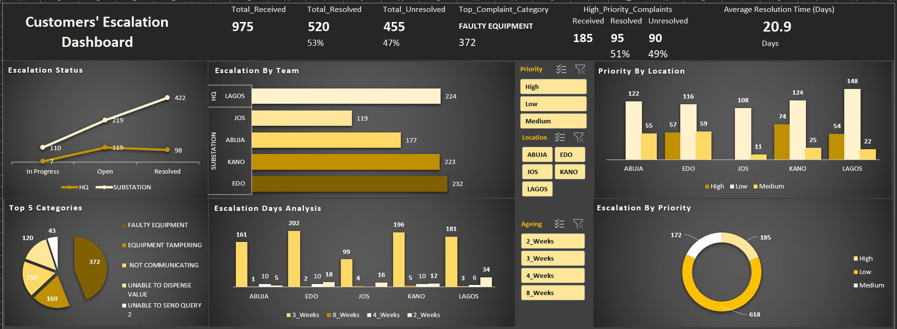

# Excel Dashboards Portfolio

## Project

### 1. Customers' Escalation Dashboard

## Problem
The business needed visibility into customer escalations — status, priority, and resolution timelines — to improve service delivery and team efficiency.

## Action
Built an Excel dashboard to clean, track, and visualize escalation data with KPIs, charts, and slicers (team, location, priority).

## Result
Managers can quickly identify bottlenecks, monitor resolution time, and focus on the top categories driving customer dissatisfaction.

**File:** `Customer_Complaints_Dashboard.xlsx`
- [Screenshot here].
- 

**Overview:**
This dashboard analyzes **customer escalation cases** across different regions and teams. It helps management monitor **issue status, priority, escalation trends, and team performance.**

**Key Insights Displayed:**

* ✅ Escalation status (In Progress, Open, Pending)
* ✅ Escalation by priority (High, Medium, Low)
* ✅ Top 5 categories of issues
* ✅ Escalation days analysis (aging trends)
* ✅ Priority breakdown by location
* ✅ Escalation by team

**Use Case:**
Ideal for **customer support teams** and **operations managers** to track unresolved issues and allocate resources effectively. It shows the turn around time for resolution, team efficeincy and service delivery towards improving customer satisfaction.

---
