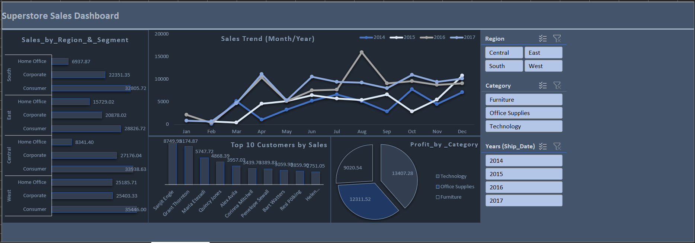

# Excel Dashboards Portfolio

Welcome to my **Excel Dashboard Projects** repository!
This repo is where I showcase my data analysis and visualization work using **Microsoft Excel**. Each dashboard demonstrates my ability to clean, analyze, and visualize datasets in a way that provides **actionable insights** for decision-making.

## Projects

### 1. Customers' Escalation Dashboard

**File:** `Customer_Complaints_Dashboard.xlsx`
- [Screenshot here].
- 

**Overview:**
This dashboard analyzes **customer escalation cases** across different regions and teams. It helps management monitor **issue status, priority, escalation trends, and team performance.**

---

### 2. Superstore Customers, Products & Orders Dashboard

**File:** `Superstore_Customers_Products_Orders.xlsx`
- [Screenshot here].

**Overview:**
A sales-focused dashboard built using the **Superstore dataset**, analyzing **customer purchasing behavior, product categories, and order trends.**

---
