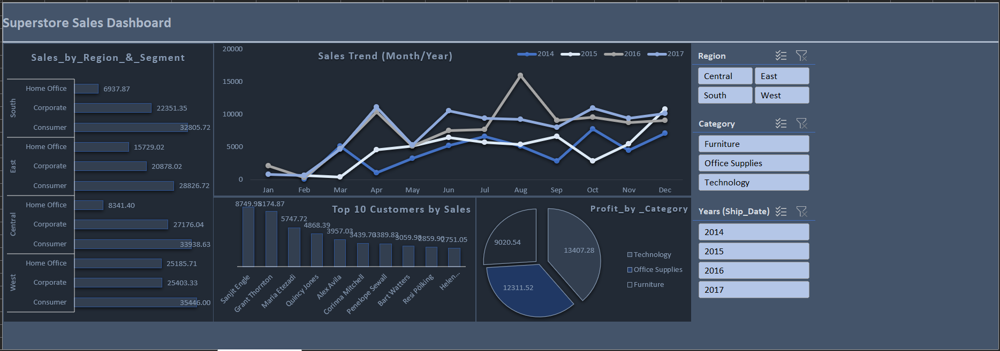

# Excel Dashboards Portfolio

## Project

### 2. Superstore Customers, Products & Orders Dashboard

**Overview:**
A sales-focused dashboard built using the **Superstore dataset**, analyzing **customer purchasing behavior, product categories, and order trends.**

## Problem
The retail business needed visibility into sales performance, customer behavior, and product profitability across regions. Without a clear view of key drivers, it was difficult for management to make data-driven sales and marketing decisions.

## Action
- Cleaned and transformed the Superstore dataset using Power Query.  
- Built an interactive Excel dashboard with PivotTables, slicers, and KPIs.  
- Visualized customer segmentation, product trends, and regional sales distribution.  

## Result
The dashboard provides executives and sales teams with actionable insights to:  
- Identify **high-value customers and segments**.  
- Track **top-performing and underperforming products**.  
- Monitor **regional sales distribution and order trends over time**.  
- Pinpoint areas to **increase profitability and optimize sales strategy**.  

**File:** `Superstore_Customers_Products_Orders.xlsx`

---

### 📊 Sales Dashboard (Excel)
- Cleaned sales dataset using Power Query.  
- Created PivotTables & interactive dashboard with slicers.  
- [Screenshot here].
- 

---

## Key Insights Displayed
- ✅ Customer segmentation & purchasing patterns  
- ✅ Product performance (top & bottom categories)  
- ✅ Regional sales & profit distribution  
- ✅ Order and revenue trends over time  
- ✅ Profitability insights  

---

## Use Case
Designed for **business analysts, sales managers, and executives** who need quick insights into performance drivers. The dashboard helps align decisions around **customers, products, and regional sales strategies**.

---

## Skills Demonstrated
- Data cleaning and transformation (Power Query)  
- PivotTables and advanced formulas  
- Conditional formatting for insights  
- Interactive slicers and filters  
- Data storytelling with charts & KPIs  
- Dashboard design and layout best practices  

