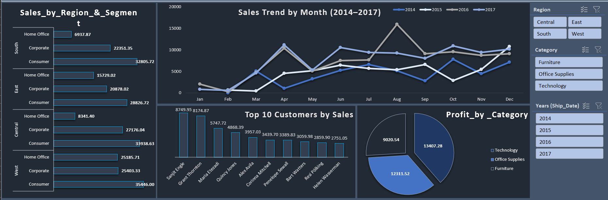

# Excel Dashboards Portfolio

## Project

### 2. Superstore Customers, Products & Orders Dashboard

**File:** `Superstore_Customers_Products_Orders.xlsx`
- 

**Overview:**
A sales-focused dashboard built using the **Superstore dataset**, analyzing **customer purchasing behavior, product categories, and order trends.**

---

## 📊 Sales Dashboard (Excel)
- Cleaned sales dataset using Power Query.  
- Created PivotTables & interactive dashboard with slicers.  
- [Screenshot here].
- 

**Key Insights Displayed:**

* ✅ Customer segmentation
* ✅ Product performance analysis
* ✅ Regional sales distribution
* ✅ Order trends over time
* ✅ Profitability insights

**Use Case:**
Useful for **business analysts and sales teams** to identify high-value customers, profitable products, and optimize sales strategies.

---

## Skills Demonstrated

* Data cleaning and transformation in Excel
* Pivot tables and advanced formulas
* Conditional formatting
* Slicers and filters for interactivity
* Data storytelling with charts and KPIs
* Dashboard design and layout best practices
