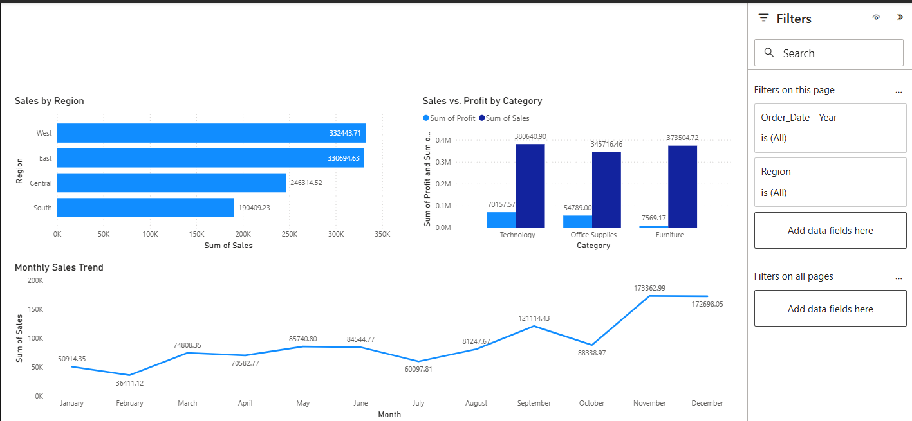

# Power BI Portfolio

## Project

### 1. Superstore Sales & Profit Dashboard

**File:** `Superstore_Sales_Profit.pbix`  
  

**Overview:**  
This Power BI dashboard analyzes sales, profit, and order trends from the Superstore dataset. It enables business leaders to track performance across regions, categories, and time periods.  

**Key Insights Displayed:**  
* ✅ Total Sales, Profit, and Orders KPIs  
* ✅ Sales distribution by Region  
* ✅ Profitability by Product Category  
* ✅ Monthly Sales Trend  
* ✅ Interactive slicers for Year and Region  

**Use Case:**  
Useful for **sales managers** and **business analysts** to monitor business performance, identify profitable categories, and adjust strategies to improve revenue.  

---

## Skills Demonstrated  
* Data cleaning with Power Query  
* Data modeling in Power BI  
* Building KPI cards and visuals  
* Dashboard design and storytelling  
