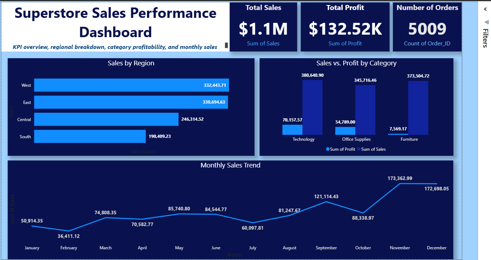

Great ✅ — here’s the **final polished README** with added *analyst-style insights* so it looks like a real business delivery:

---

# Power BI Dashboard – Superstore Sales Performance

## 📊 Project Overview

This project showcases a **Power BI interactive dashboard** built on the **Superstore dataset**, focusing on sales, profit, and order analysis.

The dashboard provides a **KPI overview, regional breakdown, category profitability, and monthly sales trends** to help businesses track performance and identify opportunities for growth.

---

## 🛠️ Key Features

**KPI Cards**

* **Total Sales:** \$1.1M
* **Total Profit:** \$132.52K
* **Number of Orders:** 5,009

**Visuals & Insights**

* **Sales by Region** – Compare performance across West, East, Central, and South.
* **Sales vs. Profit by Category** – Identify most profitable product categories.
* **Monthly Sales Trend** – Track seasonality and sales growth throughout the year.

---

## 📈 Key Insights

* **Regional Performance:** The **West (\$332K)** and **East (\$330K)** regions lead in sales, while the **South lags at \$190K**, signaling a need for targeted growth strategies.
* **Category Profitability:** **Technology (\$70K profit)** drives the majority of profit, while **Furniture (\$7K profit)** underperforms despite high sales, suggesting margin issues.
* **Seasonal Trends:** Sales **peak in November (\$173K)**, indicating holiday demand — an opportunity for promotional campaigns.

---

## 🎯 Use Case

This dashboard is ideal for:

* **Sales teams** to monitor order volume and revenue growth.
* **Executives & managers** to track profitability by category and region.
* **Business analysts** to uncover trends and support data-driven decisions.

---

## 🧰 Skills Demonstrated

* Data modeling and cleaning in Power BI
* KPI card design & formatting
* Visual storytelling with bar charts, line charts, and clustered visuals
* Dashboard layout best practices
* Interactive slicers and filters

---

## 📷 Dashboard Preview

---

## 📁 Files in this Folder

* `Superstore_Sales_Performance.pbix` → Power BI dashboard file
* `Superstore_Sales_Performance.png` → Dashboard screenshot preview
* `README.md` → Project documentation

---

⚡ *This project demonstrates my ability to create professional, business-ready dashboards in Power BI, delivering insights that drive strategic decisions.*
